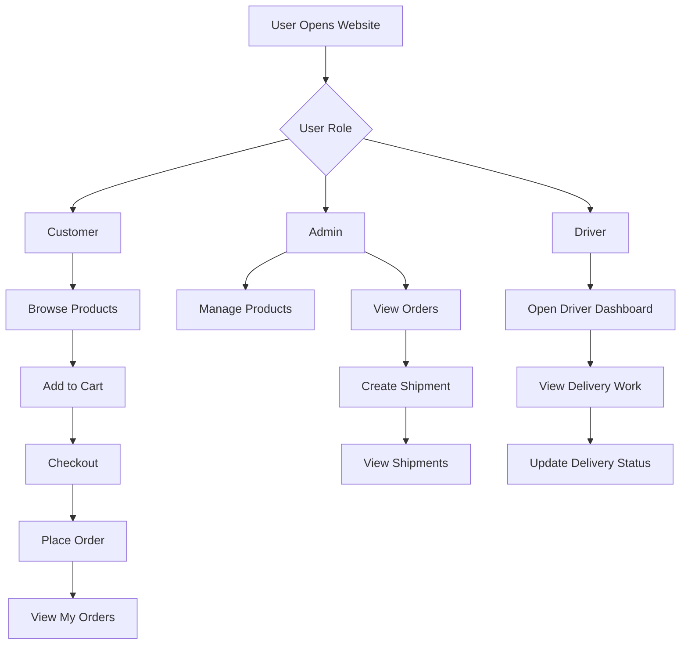
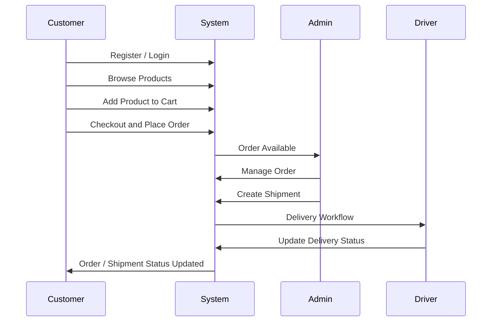

<p align="center">
  
</p>

<p align="center">
  <a href="https://github.com/sanjanalende11/SmartLogisticsSystem">
    
  </a>
</p>

<p align="center">
  
  
  
  
  
</p>

<p align="center">
  
  
  
  
</p>

<br>

<div align="center">

# ✨ Smart Logistics System

### A Java-based logistics and shopping management web application for customers, admins, and delivery drivers.

Smart Logistics System is a full-stack web application designed to manage product browsing, cart operations, order placement, shipment creation, delivery tracking, and role-based dashboards.

It is built using **Spring MVC, Hibernate, JSP, MySQL, Maven, and Apache Tomcat**.

</div>

<br>

---

## 🌟 Project Overview

**Smart Logistics System** combines an e-commerce shopping flow with logistics and shipment management.

The application supports:

- Customers browsing products and placing orders
- Admins managing products, orders, and shipments
- Drivers handling delivery workflows
- Email-based password reset using OTP
- Product image upload
- MVC-based Java web architecture

The project follows a clean layered structure with:

- `Controller`
- `DAO`
- `Service`
- `Model`
- `JSP Views`

---

## 🎯 Main Features

<table>
<tr>
<td width="50%">

### 🛒 Customer Module

- Customer registration
- Customer login
- Product browsing
- Product details page
- Cart management
- Checkout page
- Order placement
- My Orders page
- Wishlist page
- Forgot password
- OTP verification
- Password reset

</td>
<td width="50%">

### 🛡️ Admin Module

- Admin dashboard
- Add products
- Edit products
- Manage product records
- View customer orders
- View detailed order information
- Create shipments
- View shipment records
- Track delivery progress

</td>
</tr>
<tr>
<td width="50%">

### 🚚 Driver Module

- Driver dashboard
- Delivery page
- Shipment workflow
- Driver-side delivery management

</td>
<td width="50%">

### ⚙️ System Features

- Spring MVC routing
- Hibernate ORM
- MySQL database
- Maven WAR build
- JSP frontend
- JavaMail OTP system
- Multipart file upload
- Role-based dashboards

</td>
</tr>
</table>

---

## 🏗️ Tech Stack

<div align="center">

| Layer | Technology |
|---|---|
| Frontend | JSP, HTML5, CSS3, Bootstrap, JavaScript |
| Backend | Java, Spring MVC |
| ORM | Hibernate |
| Database | MySQL |
| Build Tool | Maven |
| Server | Apache Tomcat |
| Email | JavaMailSender |
| Architecture | MVC Pattern |
| Packaging | WAR |

</div>

---

## 🧩 Application Modules

### 👤 Customer

The customer module allows users to register, login, browse products, add items to cart, place orders, view orders, and manage wishlist items.

**Customer-related JSP pages:**

```bash
register.jsp
login.jsp
customerdashboard.jsp
productList.jsp
productDetails.jsp
cart.jsp
checkout.jsp
order.jsp
orderSuccess.jsp
myOrders.jsp
wishlist.jsp
forgotPassword.jsp
verifyOtp.jsp
resetPassword.jsp
```

---

### 🛠️ Admin

The admin module is used for managing products, orders, and shipments.

**Admin-related JSP pages:**

```bash
admindashboard.jsp
addProduct.jsp
editProduct.jsp
adminOrders.jsp
viewOrderDetails.jsp
createShipment.jsp
shipment.jsp
viewShipment.jsp
```

---

### 🚚 Driver

The driver module supports delivery and shipment workflow.

**Driver-related JSP pages:**

```bash
driverdashboard.jsp
delivery.jsp
```

---

## 🔄 System Workflow



---

## 🗂️ Project Structure

```bash
SmartLogisticsSystem
│
├── SmartLogisticsSystem
│   │
│   ├── pom.xml
│   │
│   ├── src
│   │   └── main
│   │       │
│   │       ├── java
│   │       │   └── com
│   │       │       │
│   │       │       ├── controller
│   │       │       │   ├── DriverController.java
│   │       │       │   ├── LoginController.java
│   │       │       │   ├── OrderController.java
│   │       │       │   ├── ProductController.java
│   │       │       │   └── ShipmentController.java
│   │       │       │
│   │       │       ├── dao
│   │       │       │   ├── OrderDAO.java
│   │       │       │   ├── ProductDAO.java
│   │       │       │   ├── ShipmentDAO.java
│   │       │       │   └── UserDAO.java
│   │       │       │
│   │       │       ├── model
│   │       │       │   ├── CartItem.java
│   │       │       │   ├── Order.java
│   │       │       │   ├── Product.java
│   │       │       │   ├── Shipment.java
│   │       │       │   └── User.java
│   │       │       │
│   │       │       └── service
│   │       │           ├── EmailService.java
│   │       │           ├── OrderService.java
│   │       │           ├── ProductService.java
│   │       │           ├── ShipmentService.java
│   │       │           └── UserService.java
│   │       │
│   │       └── webapp
│   │           ├── index.jsp
│   │           ├── uploads
│   │           │
│   │           └── WEB-INF
│   │               ├── spring-servlet.xml
│   │               ├── web.xml
│   │               │
│   │               └── views
│   │                   ├── addProduct.jsp
│   │                   ├── adminOrders.jsp
│   │                   ├── admindashboard.jsp
│   │                   ├── cart.jsp
│   │                   ├── checkout.jsp
│   │                   ├── createShipment.jsp
│   │                   ├── customerdashboard.jsp
│   │                   ├── delivery.jsp
│   │                   ├── driverdashboard.jsp
│   │                   ├── editProduct.jsp
│   │                   ├── forgotPassword.jsp
│   │                   ├── login.jsp
│   │                   ├── myOrders.jsp
│   │                   ├── order.jsp
│   │                   ├── orderSuccess.jsp
│   │                   ├── productDetails.jsp
│   │                   ├── productList.jsp
│   │                   ├── register.jsp
│   │                   ├── resetPassword.jsp
│   │                   ├── shipment.jsp
│   │                   ├── verifyOtp.jsp
│   │                   ├── viewOrderDetails.jsp
│   │                   ├── viewShipment.jsp
│   │                   └── wishlist.jsp
│   │
│   ├── .classpath
│   ├── .project
│   └── .settings
```

---

## 🧠 Core Features

### 🔐 Authentication

- User registration
- User login
- Role-based dashboard redirection
- Forgot password
- OTP verification through email
- Password reset

---

### 📦 Product Management

- Add new products
- Edit products
- Product image upload
- Product listing
- Product details view
- Product records managed by admin

---

### 🛒 Shopping Flow

- Product browsing
- Add to cart
- View cart
- Checkout
- Place order
- Order success page
- My Orders page
- Wishlist support

---

### 📋 Order Management

- Customer order placement
- Admin order listing
- Detailed order view
- Order status workflow
- Order tracking support

---

### 🚚 Shipment Management

- Shipment creation
- Shipment listing
- Delivery page
- Driver dashboard
- Shipment status workflow

---

## 🗃️ Database Configuration

The project uses MySQL database:

```sql
CREATE DATABASE db_logistics;
```

Database configuration file:

```bash
SmartLogisticsSystem/src/main/webapp/WEB-INF/spring-servlet.xml
```

Current database connection format:

```xml
<property name="driverClassName" value="com.mysql.jdbc.Driver" />
<property name="url" value="jdbc:mysql://localhost:3306/db_logistics" />
<property name="username" value="root" />
<property name="password" value="" />
```

Recommended updated driver for MySQL Connector/J 8:

```xml
<property name="driverClassName" value="com.mysql.cj.jdbc.Driver" />
```

---

## ⚙️ Maven Configuration

This project is a Maven web application.

```xml
<groupId>com.logistics</groupId>
<artifactId>SmartLogisticsSystem</artifactId>
<packaging>war</packaging>
<version>0.0.1-SNAPSHOT</version>
<finalName>SmartLogisticsSystem</finalName>
```

Main dependencies include:

| Dependency | Purpose |
|---|---|
| Spring Web MVC | Web MVC framework |
| Spring ORM | ORM integration |
| Hibernate Core | Database ORM |
| MySQL Connector/J | MySQL connectivity |
| JSTL | JSP tag support |
| JavaMail | Email OTP support |
| Jackson Databind | JSON support |
| Commons FileUpload | File upload support |
| Commons IO | File handling |

---

## 🚀 How to Run Locally

### 1. Clone the Repository

```bash
git clone https://github.com/sanjanalende11/SmartLogisticsSystem.git
```

---

### 2. Open Project Folder

```bash
cd SmartLogisticsSystem/SmartLogisticsSystem
```

---

### 3. Import in Eclipse

Open Eclipse and import the project as:

```bash
File > Import > Maven > Existing Maven Projects
```

Select this folder:

```bash
SmartLogisticsSystem/SmartLogisticsSystem
```

---

### 4. Create MySQL Database

```sql
CREATE DATABASE db_logistics;
```

---

### 5. Update Database Password

Open:

```bash
src/main/webapp/WEB-INF/spring-servlet.xml
```

Update:

```xml
<property name="username" value="root" />
<property name="password" value="your_mysql_password" />
```

---

### 6. Configure Tomcat

Recommended:

```bash
Apache Tomcat 9.x
```

Add the project to Tomcat and run it.

---

### 7. Open in Browser

```bash
http://localhost:8080/SmartLogisticsSystem/
```

---

## 📌 Important Routes

| Feature | URL |
|---|---|
| Home | `/SmartLogisticsSystem/` |
| Login | `/SmartLogisticsSystem/login` |
| Register | `/SmartLogisticsSystem/register` |
| Customer Dashboard | `/SmartLogisticsSystem/customerdashboard` |
| Admin Dashboard | `/SmartLogisticsSystem/admindashboard` |
| Driver Dashboard | `/SmartLogisticsSystem/driverdashboard` |
| Product List | `/SmartLogisticsSystem/productList` |
| Cart | `/SmartLogisticsSystem/cart` |
| Checkout | `/SmartLogisticsSystem/checkout` |
| My Orders | `/SmartLogisticsSystem/myOrders` |
| Admin Orders | `/SmartLogisticsSystem/adminOrders` |
| Create Shipment | `/SmartLogisticsSystem/createShipment` |
| View Shipment | `/SmartLogisticsSystem/viewShipment` |

---

## 🧭 Application Flow



---

## 🎨 Golden White UI Theme

This project follows a premium **Golden White** visual direction.

| Purpose | Color |
|---|---|
| Royal Gold | `#D4AF37` |
| Soft Gold | `#F7E7A1` |
| Deep Gold | `#8A6A00` |
| Cream White | `#FFFDF5` |
| Pure White | `#FFFFFF` |
| Charcoal Text | `#1F2937` |
| Muted Text | `#6B7280` |

---

## 🔒 Security Notes

Before keeping this repository public:

- Remove real email credentials from `spring-servlet.xml`
- Rotate any exposed Gmail app password
- Do not commit database passwords
- Use environment variables for sensitive values
- Avoid committing build output and IDE-generated files

Recommended `.gitignore`:

```gitignore
target/
.metadata/
.settings/
.classpath
.project
bin/
*.class
*.log
.DS_Store
Thumbs.db
```

---

## 🌍 Future Enhancements

- Online payment gateway
- Real-time shipment tracking
- Admin analytics dashboard
- Order invoice generation
- Product rating and reviews
- Email order confirmation
- SMS delivery updates
- REST API version
- Spring Boot migration
- AWS deployment
- Professional UI redesign for all JSP pages

---

## 📈 GitHub Stats

<p align="center">
  
  
</p>

---

## 🏆 Project Purpose

This project demonstrates a complete Java MVC web application with:

- Spring MVC controllers
- Hibernate ORM mapping
- MySQL database integration
- JSP frontend pages
- Role-based user workflow
- Product and order management
- Shipment and delivery tracking
- Maven WAR deployment

---

## 👩‍💻 Developer

<div align="center">

### Developed by **Sanjana Lende**

<p>
  <a href="https://github.com/sanjanalende11">
    
  </a>
</p>

</div>

---

## 📜 License

This project is created for educational and portfolio purposes.

```text
Copyright (c) 2026 Sanjana Lende

All rights reserved.

This project is intended for academic learning, personal portfolio use,
and demonstration of Java-based web application development.

Unauthorized copying, redistribution, or commercial use is not permitted
without prior permission from the owner.
```

---

<p align="center">
  
</p>

<div align="center">

### ⭐ If you like this project, give it a star on GitHub.

</div>
